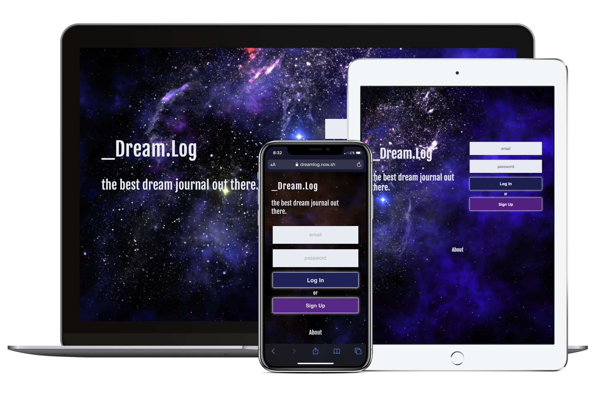

# Dream.log

This is a server for **the Dream.log App**.

_Dream.log_ App is a dream journal/blog.

You can find the client repo [here](https://github.com/pashatay/dreamlog).

For the [live page](https://dreamlog.now.sh/), the server runs on heroku.

You can use the foolowing demo user credentials:

- email: test@test.com
- password: testtest

## To set up the server localy:

1. Clone this repository to your local machine `git clone https://github.com/pashatay/dreamlog-server NEW-PROJECTS-NAME`
2. `cd` into the cloned repository
3. Create your local project database and testing database. Update **config.js** accordingly.
4. Run _Migration_ files to seed your databases.

## Scripts

Start the application `npm start`

Start nodemon for the application `npm run dev`

Run the tests `npm test`

Run migration `npm run migrate`

Run migration for testing database `npm run migrate:test`
